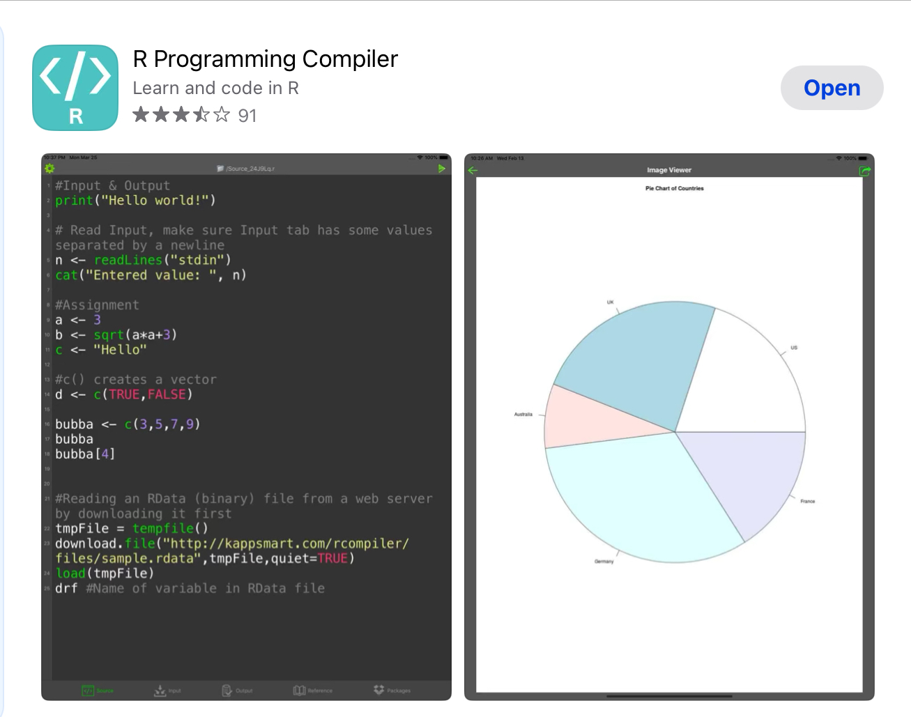
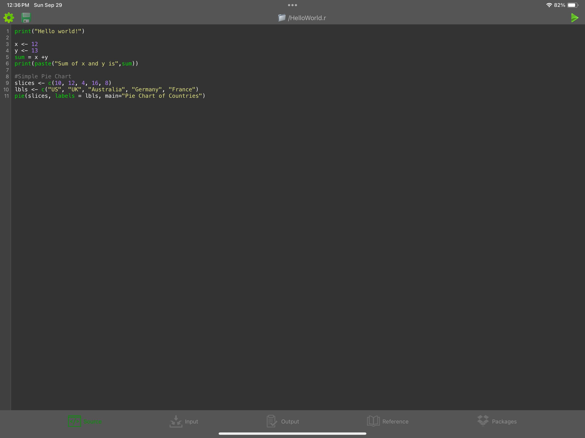

### Hi there 👋

I'm so happy I can finally get started on my R Studio 101 Self-Documenting Statistics Project/Tutorial/Repository

1. [RStudio](https://posit.co/downloads/) - Download IDE (integrated development environment) from here
2. [CURL package for R](https://cran.r-project.org/web//packages/curl/vignettes/intro.html) - pronounced "curl". Used to transfer data using various network protocols. Acronym stands for "Client for URL" [curl wiki article](https://en.wikipedia.org/wiki/CURL).
3. [A command-line tool to download photos from iCloud](https://github.com/icloud-photos-downloader/icloud_photos_downloader) - volunteer project so we're going to give it a shot and see if it compiles and works, I'll have to hop onto my Windows PC for that. That's where I have [Visual Studio Code](https://code.visualstudio.com), [NPM - Node Package Manager](https://www.npmjs.com), [Docker Desktop](https://www.docker.com/products/docker-desktop/) and all that jazz.
4. [Network Attached Storage](https://en.wikipedia.org/wiki/Network-attached_storage) - Wiki article
5. [Extracting Metadata from Large Set of Images](https://stackoverflow.com/questions/59707871/extracting-metadata-from-large-set-of-images#59708254) - Stackoverflow Post

**ldragoon/ldragoon** is a ✨ _special_ ✨ repository because its `README.md` (this file) appears on your GitHub profile.

Here are some ideas to get you started:

- 🔭 I’m currently working on CATALYST
- 🌱 I’m currently learning RStudio
- 👯 I’m looking to collaborate on Fighting Anti-Blackness, Jew-Hatred, misogyny, and queerphobia
- 🤔 I’m looking for help with data science and statistics
- 💬 Ask me about comics, Holocaust education, children's books, restorative gardening, gardening with bird help
- 📫 How to reach me: figure it out
- 😄 Pronouns: SHE/HER
- ⚡ Fun fact: This one time my dad almost dropped a Christmas tree on my head from 60 ft up.
